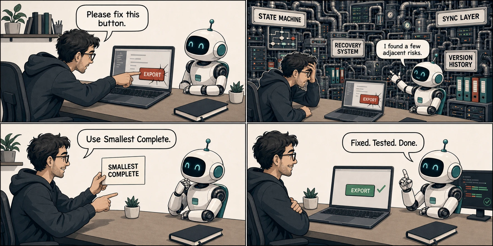
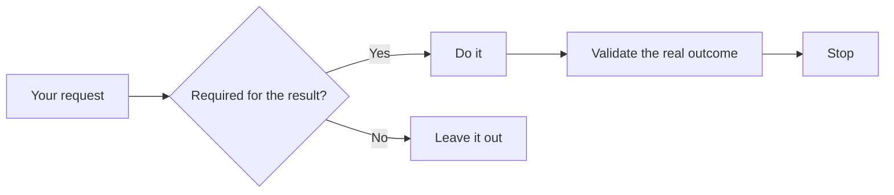

<div align="center">

# Smallest Complete

### Stop one task from becoming ten.

A lightweight Skill that helps Codex and ChatGPT agents finish the ask,
prove it works, and stop before the side quests.

<p>
  
  
  
  
</p>

</div>



<p align="center"><em>Fix the button. Not the universe.</em></p>

## Install with one prompt

**Paste → send → start a new task.**

```text
Install Smallest Complete from https://github.com/JetXu-LLM/smallest-complete.
Follow INSTALL.md exactly.
```

Codex reads the installation contract, protects your existing setup, installs
the Skill, and verifies the result. When it finishes, start a new task.

[Review every install, update, and uninstall step →](INSTALL.md)

| Installs | Preserves | Never adds |
| --- | --- | --- |
| One Skill directory + one global activation block | Existing Skills and `AGENTS.md` instructions | Runtime, hooks, dependencies, accounts, or telemetry |

## The whole idea



| Principle | Meaning |
| --- | --- |
| **Smallest** | No adjacent deliverables, speculative systems, or permanent machinery. |
| **Complete** | The requested result actually works and required behavior is preserved. |
| **Proven** | Completion claims match observable evidence. |
| **Stop** | Useful discoveries do not silently become new work. |

## In practice

| You ask | Smallest Complete response |
| --- | --- |
| “Fix CSV export when descriptions contain commas.” | Fix escaping at the owning boundary, test it, stop. No export platform. |
| “Turn these notes into five slides.” | Research what the deck needs, deliver five strong slides, stop. No brand system. |

For non-trivial software work, the Skill also loads an
[`elegant-architecture`](skills/smallest-complete/references/elegant-architecture.md)
design lens: clear ownership, one primary control path, a simple coordinator,
and only the state the real job requires.

For research, writing, analysis, and other ChatGPT Work tasks, inquiry stays as
broad as the requested result needs. The boundary applies to deliverables and
actions—not to useful thinking.

## Deliberately small

| | |
| --- | --- |
| **Runtime** | None |
| **Background process** | None |
| **Skill network calls** | None |
| **Telemetry** | None |
| **Guarantee** | None—it is guidance for capable agents, not an enforcement layer |

The complete mechanism is one Skill, one conditional software reference, and
one activation paragraph. The project practices what it asks agents to do.

## Go deeper

- [Why capable agents expand the mission](docs/why.md)
- [Design and architectural choices](docs/design.md)
- [Evaluation without invented success rates](docs/evaluation.md)
- [The complete Skill source](skills/smallest-complete/SKILL.md)
- [The exact global activation block](install/AGENTS.append.md)
- [Contributing](CONTRIBUTING.md)

## Help the next developer find it

If Smallest Complete saved a small fix from becoming a new infrastructure
department, star the repo before the next side quest ships.

## License

[MIT](LICENSE). Independent project; not affiliated with or endorsed by OpenAI
or Anthropic.
