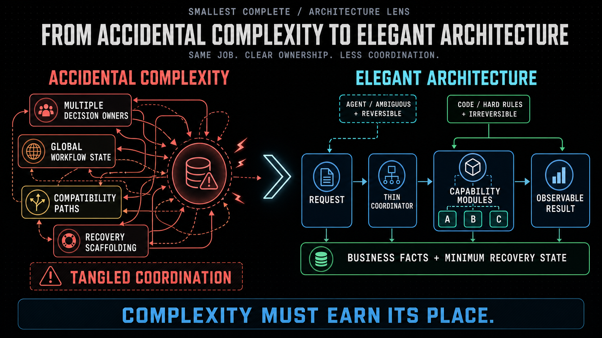

<div align="center">

# Smallest Complete — Stop one task from becoming ten.

A lightweight Skill for Codex and ChatGPT agents: once a complex job is clear
enough to act, finish exactly what was asked, prove it works, and stop before the
side quests. For non-trivial coding and architecture work, it conditionally applies an
[`elegant-architecture`](skills/smallest-complete/references/elegant-architecture.md)
lens—clear control, explicit ownership, stable handoffs, and only the state the
real job requires. When the choice of tests or other validation evidence
materially affects completion, it applies
[`evidence-calibrated-testing`](skills/smallest-complete/references/evidence-calibrated-testing.md)
to derive evidence from the real claim rather than from test volume. It works
backward from the receiver's next action, then delivers one value path within
the minimum hard boundaries that must hold now. Handoffs are complete relative
to the receiver's current state, and reader-facing results are accepted in their
actual medium and surrounding context rather than from producer checks alone.

<p>
  
  
  
  
</p>

</div>


## Install with one prompt

**Paste → send → start a new task.**

```text
Install Smallest Complete from https://github.com/JetXu-LLM/smallest-complete.
Follow INSTALL.md exactly.
```

Codex reads the installation contract, protects your existing setup, installs
the Skill, and verifies the result. When it finishes, start a new task.

[Review every install, update, and uninstall step →](INSTALL.md)

| Installs | Preserves | Never adds |
| --- | --- | --- |
| One Skill directory + one global activation block | Existing Skills and `AGENTS.md` instructions | Runtime, hooks, dependencies, accounts, or telemetry |

## One Skill, three disciplines

Smallest Complete keeps scope, architecture, and validation tied to the same real job.

| | **Scope discipline** | **Architecture discipline** | **Testing discipline** |
| --- | --- | --- | --- |
| **Applies to** | Complex Codex and ChatGPT Work tasks | Non-trivial coding, debugging, refactoring, migration, system design, or architecture work | Material test/evidence design, escaped failures, receiver/operational/real-run claims, or focused-versus-full selection |
| **Question** | Is this inside what was actually authorized? | Is this the clearest structure the evidence requires? | What failure must the evidence distinguish, at which real boundary? |
| **Stops** | Scope creep and adjacent “helpful” work | Extra decision owners, brittle handoffs, speculative defenses, and tangled coordination | Self-certified fixtures, proxy-green completion, and low-information reruns |
| **Source** | Core [`SKILL.md`](skills/smallest-complete/SKILL.md) | Conditional [`elegant-architecture.md`](skills/smallest-complete/references/elegant-architecture.md) reference | Conditional [`evidence-calibrated-testing.md`](skills/smallest-complete/references/evidence-calibrated-testing.md) reference |

The runtime references load only when their decisions are material. A simple task
stays simple. The package also includes a
[`casebook`](skills/smallest-complete/references/casebook.md) and a
[`self-contained evaluation rubric`](skills/smallest-complete/references/eval-rubric.md)
for learning, revising, and testing the method; ordinary execution does not load them.

## When the task really needs architecture

Scope discipline decides whether something belongs in the job. Architecture
discipline decides whether the necessary software structure has earned its
ongoing cost.

For architecture design, non-trivial coding, refactoring, migration, or
debugging that may change ownership, control flow, state, interfaces, or
operations, the Skill reads
[`elegant-architecture.md`](skills/smallest-complete/references/elegant-architecture.md)
before planning or editing.

[](skills/smallest-complete/references/elegant-architecture.md)

[Read the complete architecture guidance →](skills/smallest-complete/references/elegant-architecture.md)

## When validation evidence materially affects completion

For non-trivial test strategy, escaped defects, receiver, operational, or
real-run claims, or a consequential choice among focused, broad, full, and
other completion evidence, the Skill reads
[`evidence-calibrated-testing.md`](skills/smallest-complete/references/evidence-calibrated-testing.md).
It derives failure scenarios from real losses, receivers, operation, and semantic
impact; chooses the matching oracle and boundary; and limits every green claim
to the path actually exercised. Routine local checks do not load the reference.

[Read the complete testing guidance →](skills/smallest-complete/references/evidence-calibrated-testing.md)

## The core contract

| Principle | Meaning |
| --- | --- |
| **Smallest** | No adjacent deliverables, speculative systems, or permanent machinery. |
| **Complete** | The requested result works for its next receiver in the real medium, with required behavior preserved. |
| **Coherent** | Long work keeps one route; local fixes fit it or replace part of it, and declared handoffs stay stable. |
| **Proven** | Completion claims match observable evidence. |
| **Stop** | Useful discoveries do not silently become new work. |

## In practice

| You ask | Smallest Complete response |
| --- | --- |
| “Fix CSV export when descriptions contain commas.” | Fix escaping at the owning boundary, test it, stop. No export platform. |
| “Refactor this ingestion workflow.” | Exercise representative real input through the receiver's next action, keep one control path, and add hardening only when a current boundary or evidence requires it. |
| “Turn these notes into five slides.” | Research what the deck needs, deliver five strong slides, stop. No brand system. |

For research, writing, analysis, and other ChatGPT Work tasks, inquiry stays as
broad as the requested result needs. The boundary applies to deliverables and
actions—not to useful thinking.

## Deliberately small

| | |
| --- | --- |
| **Runtime** | None |
| **Background process** | None |
| **Skill network calls** | None |
| **Telemetry** | None |
| **Guarantee** | None—it is guidance for capable agents, not an enforcement layer |

The complete runtime mechanism is one Skill, two conditional references, and one
activation paragraph. Two non-runtime evaluation references ship beside it so
the method can be tested without making evaluation ceremony part of every task.

## Go deeper

- [The complete elegant-architecture reference](skills/smallest-complete/references/elegant-architecture.md)
- [The complete evidence-calibrated-testing reference](skills/smallest-complete/references/evidence-calibrated-testing.md)
- [The phase-specific casebook](skills/smallest-complete/references/casebook.md)
- [The self-contained evaluation rubric](skills/smallest-complete/references/eval-rubric.md)
- [Why capable agents expand the mission](docs/why.md)
- [Design and architectural choices](docs/design.md)
- [Evaluation without invented success rates](docs/evaluation.md)
- [The complete Skill source](skills/smallest-complete/SKILL.md)
- [The exact global activation block](install/AGENTS.append.md)
- [Contributing](CONTRIBUTING.md)

## Bring us the case we missed

The most useful contribution is not agreement. It is a concrete task where the
Skill helped, failed, made no difference, activated at the wrong time, or gave
architecture advice that was wrong for the real system.

Comparative runs and counterexamples are especially welcome. You do not need to
propose a fix—a sanitized prompt, expected result, observed behavior, and the
available evidence are enough to start.

[Open a behavior report →](https://github.com/JetXu-LLM/smallest-complete/issues/new?template=behavior-report.yml)
· [See what makes a useful contribution →](CONTRIBUTING.md)

## Star it if it earned it

If Smallest Complete stopped one bounded task from becoming an architecture
project—or helped you build the architecture the task actually needed—click
**Star** at the top of this page. It helps the next developer find it before
their next five-line fix becomes a framework.

## License

[MIT](LICENSE). Independent project; not affiliated with or endorsed by OpenAI
or Anthropic.
